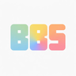

<div align="center">



# BBS Refreshed UI

**A modern, refreshed UI theme for [bbs-fs](https://github.com/Wemppy4/bbs-fs) — a fork of the BBS Minecraft mod — shipped as a clean Fabric mixin addon.**

[](#supported-versions)
[](https://fabricmc.net/)
[](LICENSE)

</div>

---

> [!IMPORTANT]
> This addon targets **[bbs-fs](https://github.com/Wemppy4/bbs-fs)** (the fork) — **not** the original BBS by McHorse. It is built and tested against bbs-fs and will not work with upstream BBS.

## What is this?

**BBS Refreshed UI** restyles the [bbs-fs](https://github.com/Wemppy4/bbs-fs) interface with a cleaner, more modern look — rounded surfaces, softer contrast and a refined typeface — **without modifying bbs-fs itself**.

Every change is applied through [Mixins](https://github.com/SpongePowered/Mixin), so the base mod stays untouched and stays easy to update. Drop the addon in next to bbs-fs and the theme applies automatically.

## Features

- **Rounded UI primitives** — buttons, toggles, trackpads, icons and panels gain consistent rounded corners through a custom set of `Batcher2D` drawing primitives (`roundedBox`, `roundedFrame`, `filledCircle`, …).
- **Adaptive contrast** — button labels and active icons automatically switch between black and white based on the fill brightness, so text stays legible on any accent colour.
- **Custom UI font** — bundles the [Inter](https://rsms.me/inter/) typeface rendered through [Caxton](https://modrinth.com/mod/caxton) (MSDF), scoped to the bbs-fs interface only.
- **Refreshed icon atlas & menu banner** — a redrawn icon set and a new main-menu banner, layered in via a resource source-pack.
- **Immersive form editor** — a subtle backdrop behind the form editor's right panel for a more focused editing surface.
- **Reworked toggles** — toggle switches rendered from scratch with smooth state animation.
- _(Experimental)_ **Bounded trackpads as sliders** — numeric inputs that have a min/max range render as draggable sliders.

## Supported versions

The addon is maintained per Minecraft version on separate branches:

| Minecraft | Branch |
|-----------|--------|
| 1.20.4    | [`master`](../../tree/master) |
| 1.20.1    | [`1.20.1`](../../tree/1.20.1) |
| 1.21.1    | [`1.21.1`](../../tree/1.21.1) |

## Requirements

- [Fabric Loader](https://fabricmc.net/) 0.15+
- [Fabric API](https://modrinth.com/mod/fabric-api)
- **[bbs-fs](https://github.com/Wemppy4/bbs-fs)** — the BBS fork this addon targets (not the original BBS)
- [Caxton](https://modrinth.com/mod/caxton)
- Java 17+

## Building from source

> [!NOTE]
> The bbs-fs mod jar is a **build dependency** and is intentionally **not** included in this repository — it is third-party software. You need to supply it yourself.

1. Obtain the matching bbs-fs jar (e.g. `bbs-2.2-1.20.4.jar` for the `master` branch) and drop it into `libs/`.
2. Build the addon:
   ```bash
   ./gradlew build
   ```
   The packaged jar is written to `build/libs/`.

To launch a development client:
```bash
./gradlew runClient
```

## Installation

1. Install Fabric Loader, Fabric API, bbs-fs and Caxton.
2. Place the built `refreshedui-*.jar` into your `mods/` folder, alongside bbs-fs.
3. Launch the game — the refreshed theme applies automatically.

## How it works

All visual changes are injected at runtime; nothing is patched into bbs-fs on disk:

- **New rendering primitives** are added to the mod's `Batcher2D` through an accessor mixin, then used by the themed elements.
- **Targeted tweaks** (colours, shadows, fills, corner radii) use [MixinExtras](https://github.com/LlamaLad7/MixinExtras) `@ModifyExpressionValue` / `@Redirect` — these are resilient to bbs-fs updates.
- **Fully reworked renderers** — a few elements (the toggle switch and the scrollbar handle) are drawn from scratch via `@Overwrite`. These are the version-sensitive spots and are kept deliberately small.
- **Assets** (icons, banner, fonts) are layered in through a resource source-pack, leaving the base mod's own files in place.

## Credits

- [**bbs-fs**](https://github.com/Wemppy4/bbs-fs) by **Wemppy4** — the BBS fork this theme is built for.
- **BBS** by [McHorse](https://github.com/mchorse) — the original mod that bbs-fs forks.
- [**Inter**](https://rsms.me/inter/) by Rasmus Andersson — UI typeface (SIL Open Font License 1.1).
- [**Caxton**](https://modrinth.com/mod/caxton) — MSDF font rendering for Minecraft.

## License

Released under the [MIT License](LICENSE).
